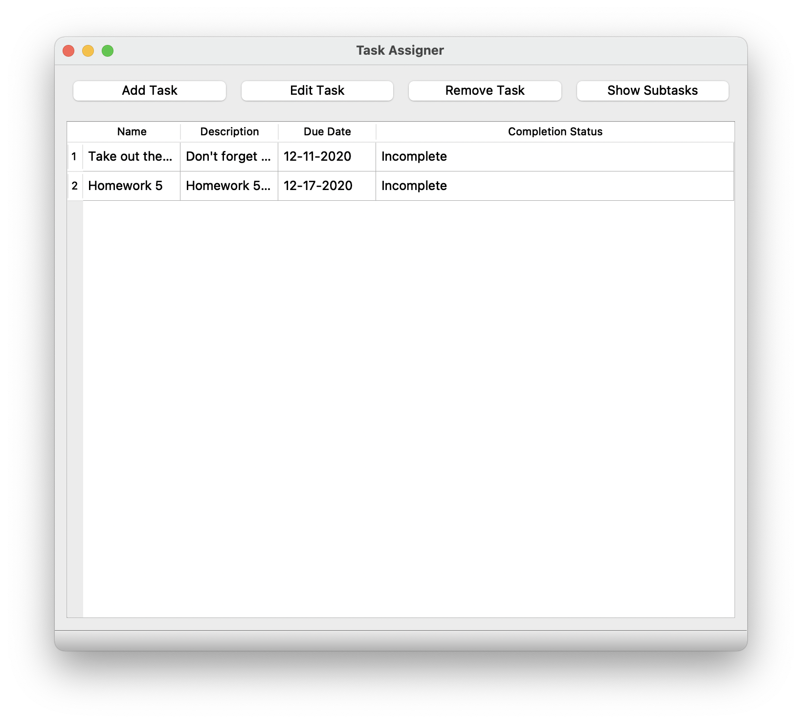
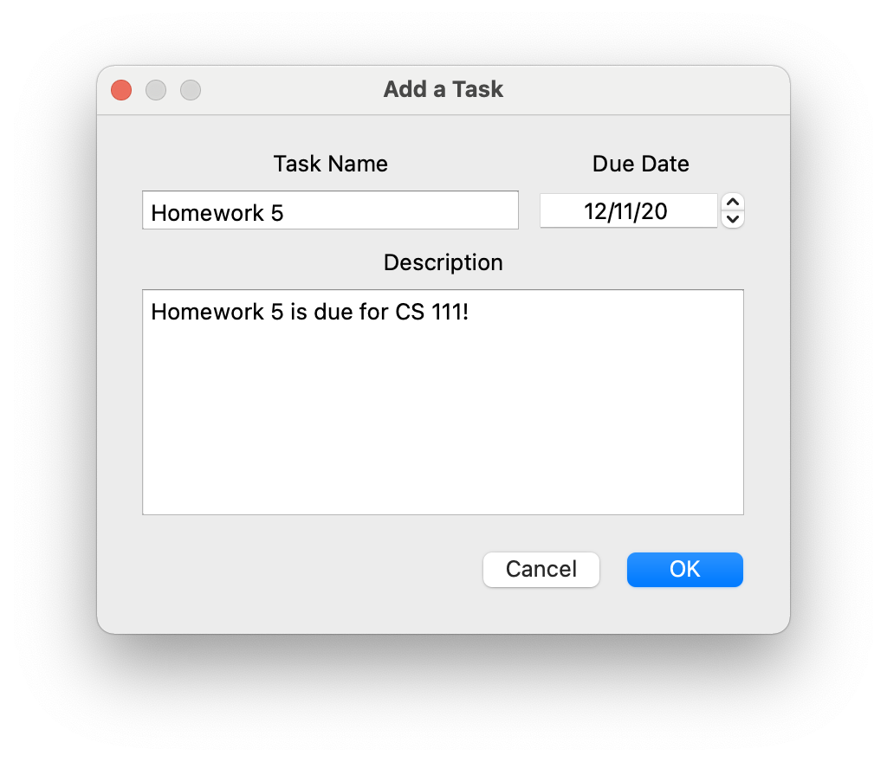
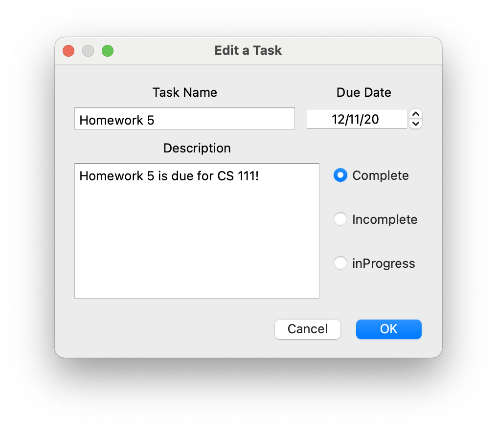

# Task Assigner

#### Authors:

 [Arzhang Valadkhani](https://github.com/arzhangv), [Shawn Long](https://github.com/shawnlong636), [Yuval Bar](https://github.com/yuval4597)

#### Credits:

CMake Configuration by [Vincent Lee](https://github.com/euler0/) and his open source project [mini-cmake-qt](https://github.com/euler0/mini-cmake-qt) 

Icons made by <a href="https://www.flaticon.com/authors/freepik" title="Freepik">Freepik</a> from <a href="https://www.flaticon.com/" title="Flaticon">www.flaticon.com</a>

UI framework provided by [Qt](https://www.qt.io)

Unit testing provided by Google's [gtest](https://github.com/google/googletest)

## Project Description
  - For our project we've decided to go with a designing a task assigner application that lets the user create a task, assign it to a person, and give a time and date to compelete the task by. Their will be an easy to use graphical interface.
  - This project is interesting to us, because it can reflect a planner for chores at home, a task board for people in a group can use, or even a simple todo list. Planners with time blocks tend to be the best for productivatie so it would be interesting to build one. 
  - C++ 
 - Qt, https://www.qt.io/ 
    *What will be the input/output of your project?
 - The input will be whatever the user inputs to the textboxes.
  - The output will be the task, the person it's assigned to, and the time in which it is due.
 * What are the three design patterns you will be using. For each design pattern you must explain in 3 - 5 sentences why you picked this pattern and what feature you will implement with it:
 - *Strategy Method* - In order to manage the tasks the user will need to be able to add, edit, and remove them respectively. The strategy pattern allows the program  to have different implementations for dialog boxes that will appear when the corresponding button is pressed. All that is left then is to create the dialog box based on the required strategy.
 - *Composite Method*- The user should be able to interact with the tasks similarly to a list. Each task can have sub tasks and notes similarly to a tree structure. To implement this, we can create a composite interface which our task and tasklist can inherit from. This means that the same functions that a user calls on a task will also work for a task list.
 - *State Method* - Task objects exist in one of three states: complete, incomplete, or in progress. Task methods function differently depending on the state of the task. While the DialogueStrategy determines how dialogue windows are displayed, the completions state allows tasks to change behavior dynamically based on the current status. This also means that states are extensible and can be added as needed without affecting the task class.
  * This description should be in enough detail that the TA/instructor can determine the complexity of the project and if it is sufficient for the team members to complete in the time allotted. 

## Class Diagram

 ## Screenshots

 

 ## Installation/Usage
  * Non-Mac Users
    - To run our program you need to download and install Qt
    - Clone this repository, and make sure to clone the google test file as well
    - Open Qt, click on open project, and click on the CMakeLists.txt file attached to the project
    - Once CMake has ran TaskAssigner should be ready to be built!
  * Mac Users Installation
    - First go to the tag page in this repository
    - Click on 1.0 and download the TaskAssigner.dmg file
    - Copy the app to applications folder to install
    - Note: Users on MacOS Mojave or above may need to allow permissions via System Preferences > Security and Privacy > General > Allow
 ## Testing
 - The project was tested through a series of various unit tests throught Google Tests.
 - Each Unit Test for the classes our seperated into header files and then ran through test.cpp.
 - We tested the values of our composite Task class as well as tested its child instances.
 - We also tested the CompletionState class for completion or incompletion.
