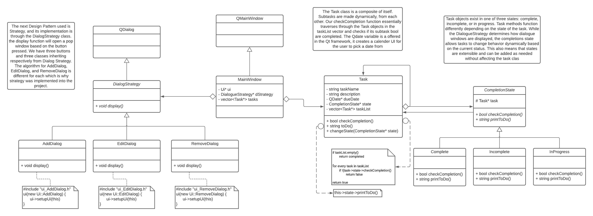

 > As you complete each section you **must** remove the prompt text. Every *turnin* of this project includes points for formatting of this README so keep it clean and keep it up to date. 
 > Prompt text is any lines beginning with "\<"
 > Replace anything between \<...\> with your project specifics and remove angle brackets. For example, you need to name your project and replace the header right below this line with that title (no angle brackets). 
# Task Assigner
 > Your author list below should include links to all members GitHub and should begin with a "\<" (remove existing author).

 > Authors: [Arzhang Valadkhani](https://github.com/arzhangv), [Shawn Long](https://github.com/shawnlong636), [Yuval Bar](https://github.com/yuval4597)

 > You will be forming a group of **THREE** students and work on an interesting project that you will propose yourself (in this `README.md` document). You can pick any project that you'd like, but it needs ot implement three design patterns. Each of the members in a group is expected to work on at least one design pattern and its test cases. You can, of course, help each other, but it needs to be clear who will be responsible for which pattern and for which general project features.

 > ## Expectations
 > * Incorporate **three** distinct design patterns, *two* of the design patterns need to be taught in this course:
 >   * Composite, Strategy, Abstract Factory, Visitor
 > * All three design patterns need to be linked together (it can't be three distinct projects)
 > * Your project should be implemented in C/C++. If you wish to choose anoher programming language (e.g. Java, Python), please discuss with your lab TA to obtain permission.
 > * You can incorporate additional technologies/tools but they must be approved (in writing) by the instructor or the TA.
 > * Each member of the group **must** be committing code regularly and make sure their code is correctly attributed to them. We will be checking attributions to determine if there was equal contribution to the project.

## Project Description
   - For our project we've decided to go with a designing a task assigner application that lets the user create a task, assign it to a person, and give a time and date to compelete the task by. Their will be an easy to use graphical interface.
   - This project is interesting to us, because it can reflect a planner for chores at home, a task board for people in a group can use, or even a simple todo list. Planners with time blocks tend to be the best for productivatie so it would be interesting to build one. 
   - C++ 
   - Qt, https://www.qt.io/ 
      *What will be the input/output of your project?
   - The input will be whatever the user inputs to the textboxes.
   - The output will be the task, the person it's assigned to, and the time in which it is due.
  * What are the three design patterns you will be using. For each design pattern you must explain in 3 - 5 sentences why you picked this pattern and what feature you will implement with it:
    - *Strategy Method* - In order to manage the tasks the user will need to be able to add, edit, and remove them respectively. The strategy pattern allows the program to have different implementations for dialog boxes that will appear when the corresponding button is pressed. All that is left then is to create the dialog box based on the required strategy.
    - *Composite Method*- The user should be able to interact with the tasks similarly to a list. Each task can have sub tasks and notes similarly to a tree structure. To implement this, we can create a composite interface which our task and tasklist can inherit from. This means that the same functions that a user calls on a task will also work for a task list.
    - *State Method* - Task objects exist in one of three states: complete, incomplete, or in progress. Task methods function differently depending on the state of the task. While the DialogueStrategy determines how dialogue windows are displayed, the completions state allows tasks to change behavior dynamically based on the current status. This also means that states are extensible and can be added as needed without affecting the task class.
  * This description should be in enough detail that the TA/instructor can determine the complexity of the project and if it is sufficient for the team members to complete in the time allotted. 

 > ## Phase II
 > In addition to completing the "Class Diagram" section below, you will need to 
 > * Set up your GitHub project board as a Kanban board for the project. It should have columns that map roughly to 
 >   * Backlog, TODO, In progress, In testing, Done
 >   * You can change these or add more if you'd like, but we should be able to identify at least these.
 > * There is no requirement for automation in the project board but feel free to explore those options.
 > * Create an "Epic" (note) for each feature and each design pattern and assign them to the appropriate team member. Place these in the `Backlog` column
 > * Complete your first *sprint planning* meeting to plan out the next 7 days of work.
 >   * Create smaller development tasks as issues and assign them to team members. Place these in the `Backlog` column.
 >   * These cards should represent roughly 7 days worth of development time for your team, taking you until your first meeting with the TA
## Class Diagram
 > Include a class diagram(s) for each design pattern and a description of the diagram(s). This should be in sufficient detail that another group could pick up the project this point and successfully complete it. Use proper OMT notation (as discussed in the course slides). You may combine multiple design patterns into one diagram if you'd like, but it needs to be clear which portion of the diagram represents which design pattern (either in the diagram or in the description). 

 > ## Phase III
 > You will need to schedule a check-in with the TA (during lab hours or office hours). Your entire team must be present. 
 > * Before the meeting you should perform a sprint plan like you did in Phase II
 > * In the meeting with your TA you will discuss: 
 >   - How effective your last sprint was (each member should talk about what they did)
 >   - Any tasks that did not get completed last sprint, and how you took them into consideration for this sprint
 >   - Any bugs you've identified and created issues for during the sprint. Do you plan on fixing them in the next sprint or are they lower priority?
 >   - What tasks you are planning for this next sprint.

 > ## Final deliverable
 > All group members will give a demo to the TA during lab time. The TA will check the demo and the project GitHub repository and ask a few questions to all the team members. 
 > Before the demo, you should do the following:
 > * Complete the sections below (i.e. Screenshots, Installation/Usage, Testing)
 > * Plan one more sprint (that you will not necessarily complete before the end of the quarter). Your In-progress and In-testing columns should be empty (you are not doing more work currently) but your TODO column should have a full sprint plan in it as you have done before. This should include any known bugs (there should be some) or new features you would like to add. These should appear as issues/cards on your Kanban board. 
 ## Screenshots
 > Screenshots of the input/output after running your application
 ## Installation/Usage
 > Instructions on installing and running your application
 ## Testing
 > How was your project tested/validated? If you used CI, you should have a "build passing" badge in this README.

